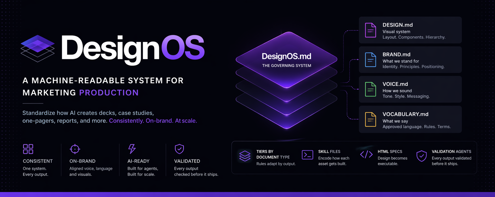
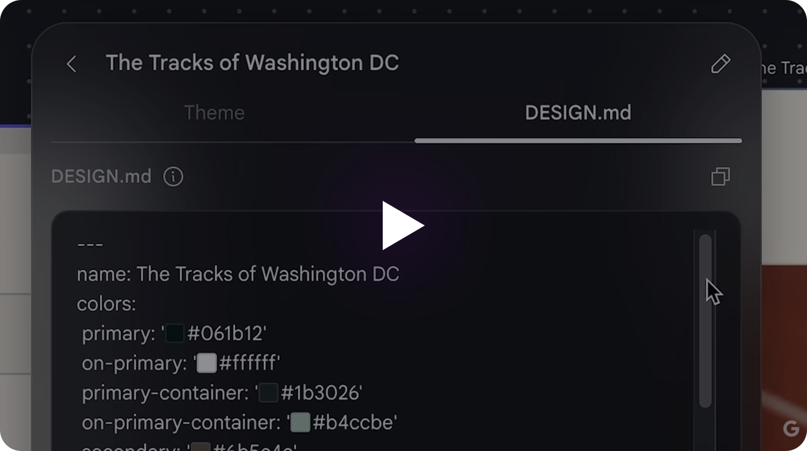

A machine-readable system for consistent, scalable marketing production using AI.

This is not just a design system.

It is a full operating system for how content gets created, structured, and validated across outputs like decks, case studies, reports, and one-pagers.

---

## Quick Example

Turn this:

```text
"Create a marketing case study"
```

Into this:

```md
Use DESIGN.md, BRAND.md, VOICE.md, and VOCABULARY.md to generate a structured case study with clear hierarchy, consistent tone, and defined sections (Problem, Solution, Results).
```
---

## DESIGN.md Example

```yaml
colors:
  primary: "#2665fd"
  surface: "#0b1326"
  on-surface: "#dae2fd"

spacing:
  base: 8
  scale: [4, 8, 16, 24]
```

Design is no longer abstract.  
It becomes a system AI can read and execute.

---

## Why DesignOS

[](https://www.youtube.com/watch?v=W1gWIQp9k1Y)

Most design systems stop at UI.

They define tokens, colors, and components.

That works for product teams.

It breaks for marketing.

Marketing outputs are:
- Unstructured
- Variable in format
- Dependent on narrative, layout, and tone

DesignOS solves this by standardizing **how content is built**, not just how it looks.

---

## Core Idea

AI needs **machine-readable systems** to produce consistent results.

DesignOS provides that system.

It defines:
- What to say
- How to say it
- How it should look
- How it should be structured

Before anything ships.

---

## File Structure

- [DESIGN.md](designos/DESIGN.md) - Visual system (layout, components, hierarchy)  
- [BRAND.md](designos/BRAND.md) - Brand identity and principles  
- [VOICE.md](designos/VOICE.md) - Tone and communication style  
- [VOCABULARY.md](designos/VOCABULARY.md) - Approved language and naming rules  
- [DESIGN_OS.md](designos/DESIGN_OS.md) - Governing system (rules, logic, orchestration)

## System Logic

```text
Input → System → Output

DESIGN.md → Layout and hierarchy  
VOICE.md → Tone and clarity  
VOCABULARY.md → Terminology  
BRAND.md → Identity  

= Structured, consistent outputs
```

---

## How to Use with AI

1. Copy the system files into your project:
   - DESIGN.md
   - BRAND.md
   - VOICE.md
   - VOCABULARY.md

2. Paste into your AI tool

3. Use this prompt:

```md
Use this DesignOS system to generate a landing page for a SaaS product. Follow the structure, tone, and design rules defined in the files.
```

---

## DESIGN.md Resources

- https://getdesign.md/ - Official DESIGN.md overview and examples  
- https://github.com - Search "DESIGN.md" to explore real implementations  
- https://designmd.ai/ - AI-powered tools and workflows built around DESIGN.md  
- https://designmd.app/en/ - Interactive platform for exploring and using DESIGN.md  
- https://chromewebstore.google.com/detail/designmd-style-extractor/ogpdnchdjiibhobphelbbkemnnemkfma?pli=1 - Chrome extension to extract styles into DESIGN.md format 

---

## What Each File Does

### DESIGN.md
Defines the visual system.

- Layout rules
- Component behavior
- Spacing and hierarchy
- Interaction patterns

Not token-based - built for real outputs.

---

### BRAND.md
Defines what the brand stands for.

- Visual identity
- Color usage
- Design principles

---

### VOICE.md
Defines how the brand communicates.

- Tone
- Writing style
- Messaging structure

---

### VOCABULARY.md
Defines what language is allowed.

- Approved terms
- Banned terms
- Naming conventions
- Microcopy rules

---

### DesignOS.md
The brain of the system.

- Governs all files
- Defines how outputs are generated
- Enforces consistency across assets
- Connects design, brand, and language into one system

---

## What Makes This Different

Traditional systems:
- Focus on UI
- Stop at tokens
- Assume human execution

DesignOS:
- Built for AI + human workflows
- Covers full content production
- Applies to marketing outputs, not just interfaces
- Includes validation logic before publishing

---

### Document Tiers
Different rules depending on output type:
- [Decks](examples/deck.md)
- [Case studies](examples/case-study.md)
- [Reports](examples/report.md)
- [Landing pages](examples/landing-page.md)

---

## Version

DesignOS v1.0

This version defines the core system:
- DESIGN.md
- BRAND.md
- VOICE.md
- VOCABULARY.md
- DESIGN_OS.md

Future versions will expand validation, automation, and system integrations.

---

### Skill Files
Encodes how each asset is built step-by-step.

---

### HTML Specs
Design becomes executable structure.

---

### Validation Agents
Outputs are checked before shipping:
- Layout consistency
- Tone alignment
- Vocabulary compliance

---

## Use Cases

- Marketing teams using AI
- Agencies scaling content production
- Founders building consistent brand outputs
- Designers bridging UI and marketing systems

---

## How to Use

1. Clone or download the repo
2. Add files to your project
3. Use them as input context for AI tools (ChatGPT, Claude, etc.)
4. Generate outputs with structured consistency

---

## Principle

If content is not structured, it cannot scale.

DesignOS introduces constraints so AI can produce consistent, high-quality outputs.

---

## Contributing

This system is evolving.

Feel free to fork, adapt, and extend based on your workflows.

---
